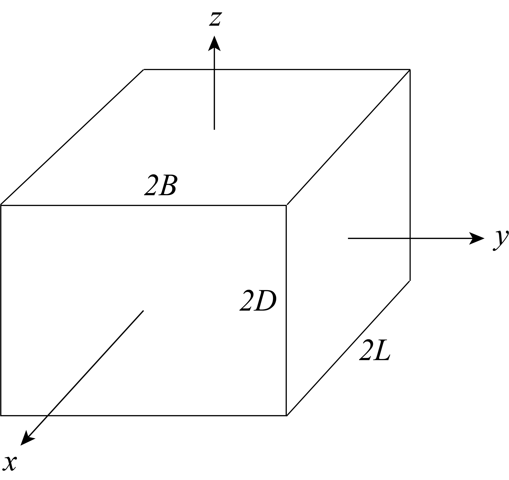
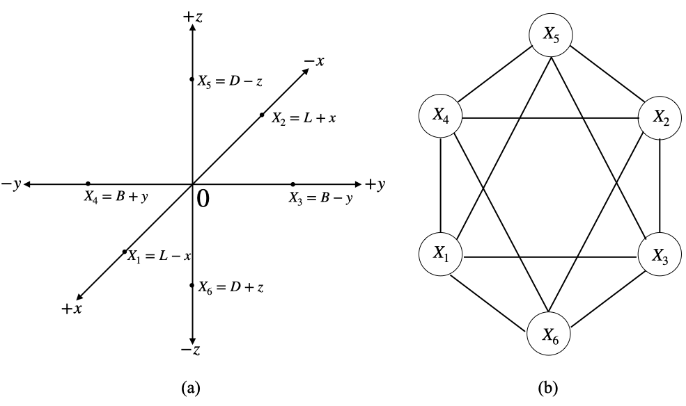
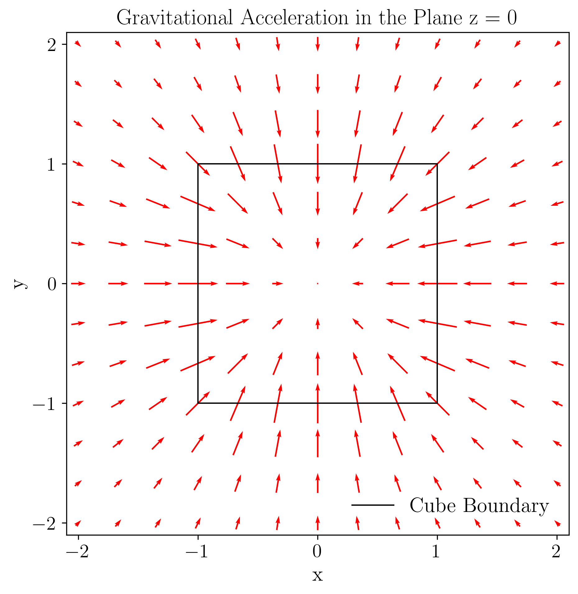
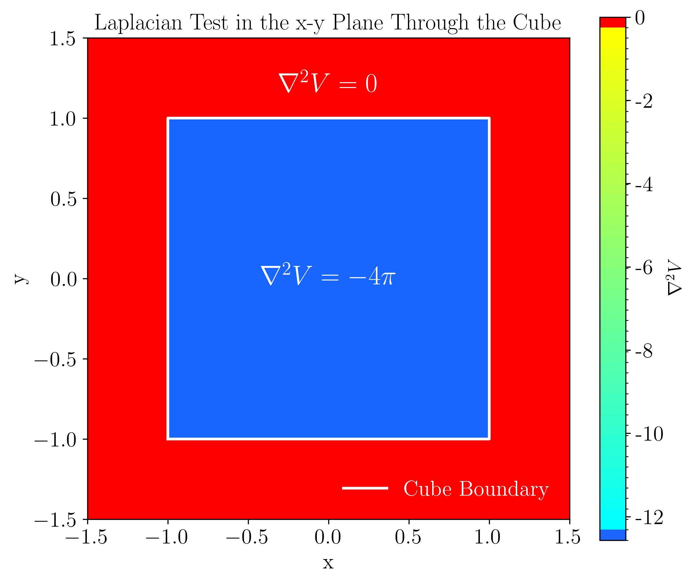

# Gravitational Potential of a Homogeneous Cuboid  
### Python • MATLAB • Julia Implementations  
### Periyandy & Bevis (2025)

---

## 📘 Overview

This repository provides the **first fully general algorithm** for computing the **gravitational potential of a homogeneous cuboid**:

- Valid **inside**, **on**, and **outside** the cuboid  
- Numerically stable: avoids log/atan singularities  
- Based on a **hexagonal graph formulation**  
- Validated using **Laplacian tests**, **gradient tests**, and **point-mass asymptotics**

These codes accompany the peer-reviewed publication:

**Periyandy, T. & Bevis, M. (2025).  
_A Generalized Algorithm for the Gravitational Potential of a Homogeneous Cuboid._  
Physics International, 16(1), 7–17. https://doi.org/10.3844/pisp.2025.7.17 **  

🔗 Journal link: https://thescipub.com/abstract/pisp.2025.7.17  

---

## 📐 Physical Model

### Cuboid Geometry  
The gravitational potential is computed for a cuboid with semi-dimensions:

- **L** — half-length (x-direction)  
- **B** — half-breadth (y-direction)  
- **D** — half-depth (z-direction)

The cuboid is centered at the origin.

<p align="center">
  <br>
  <em>Fig. 1 — Cuboid geometry used in the formulation.</em>
</p>

### Hexagonal Graph Organization  
Logarithmic and arctangent terms are structured using a **hexagonal graph**, ensuring correct sign allocation and eliminating singular behaviors.

<p align="center">
  <br>
  <em>Fig. 2 — Hexagonal graph encoding the six directional components.</em>
</p>

---

## ✨ Key Features

- ✔ Valid on **all spatial regions** (interior, exterior, surfaces, edges, vertices)  
- ✔ Fully analytical expression with special-case handling  
- ✔ Stable logarithmic and arctangent formulations  
- ✔ High-precision validation using BigFloat (Julia)  
- ✔ Consistent results across MATLAB, Python, and Julia  
- ✔ Includes **examples**, **tests**, and **pseudocode**  

---

## 📊 Scientific Validation

### 1️⃣ Gradient (Acceleration) Test

<p align="center">
  <br>
  <em>Fig. 4 — Gravitational acceleration vectors inside and outside the cuboid.</em>
</p>

This verifies directional symmetry and interior decay toward the center.

---

### 2️⃣ Laplacian Test

Poisson’s equation requires:

- **Inside the cuboid:** ∇²V = −4πGρ  
- **Outside the cuboid:** ∇²V = 0  

<p align="center">
  <br>
  <em>Fig. 5 — Laplacian test on a 300 × 300 grid through the cuboid.</em>
</p>

The test confirms numerical correctness across the entire domain.

---

## 📂 Repository Structure

```
GravitationalPotentialCuboid/
│
├── python/
│   ├── utils/
│   │   ├── safe_math.py
│   │   ├── surfaces.py
│   │   ├── potential.py
│   │   └── __init__.py
│   ├── CuboidPotentialExamples.ipynb
│   └── README_python.md
│
├── matlab/
│   ├── Gravitational_potential_cuboid.m
│   ├── Laplacian.m
│   ├── Example_01.m
│   ├── Example_02.m
│   ├── Example_03.m
│   └── README_matlab.md
│
├── julia/
│   ├── Gravitational_Potential_of_Cuboid.jl
│   ├── LaplacianTest.jl
│   ├── GP_Example1.jl
│   ├── GP_Example2.jl
│   ├── GP_Laplacian_Test_Example_02.jl
│   └── README_julia.md
│
├── docs/
│   ├── algorithm_pseudocode.md
│   ├── references.md
│   └── images/
│       ├── Fig_1.png
│       ├── Fig_2.png
│       ├── Fig_4.png
│       └── Fig_5.png
│
└── README.md   <-- (this file)
```

---

## 🚀 Implementations

### 🔹 Python  
✔ Vectorized  
✔ Multiprocessing batch solver  
✔ Stable log/atan functions  
📄 See: `/python/README_python.md`

---

### 🔹 MATLAB  
✔ Vectorized  
✔ Fully validated test suite  
📄 See: `/matlab/README_matlab.md`

---

### 🔹 Julia  
✔ Arbitrary precision (BigFloat)  
✔ High-accuracy Laplacian and gradient tests  
📄 See: `/julia/README_julia.md`

---

## 🧠 Algorithm Pseudocode

Complete pseudocode is available at:

**`/docs/algorithm_pseudocode.md`**

It follows the structure in the published manuscript.

---

## 📚 References

Complete list: `/docs/references.md`

Primary citation:

Periyandy, T. & Bevis, M. (2025). A Generalized Algorithm for the Gravitational Potential of a Homogeneous Cuboid. Physics International, 16(1), 7-17. https://doi.org/10.3844/pisp.2025.7.17

  
Download: https://thescipub.com/abstract/pisp.2025.7.17

If you use these codes in research, **please cite this work**.

---

## 📬 Contact

For questions or collaborations:

📧 periyandy.1@osu.edu  
🌐 Division of Geodetic Science, School of Earth Sciences, The Ohio State University, Columbus, OH 43210, USA
🌐 Faculty of Geomatics, Sabaragamuwa University of Sri Lanka, Sri Lanka


